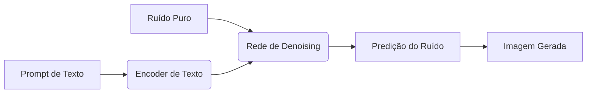

# Tratado Técnico: Engenharia de Sistemas Inteligentes e Fundamentos Matemáticos

Este documento consolida os princípios teóricos, a álgebra linear aplicada e a mecânica estocástica que governam os sistemas de Inteligência Artificial modernos. O conteúdo deriva de uma análise técnica aprofundada das arquiteturas de *Machine Learning* (Estocástico), *Deep Learning* (Conexionista) e *Generative AI* (Probabilístico).

---

## 1. Taxonomia e Abstração Computacional

[cite_start]A precisão terminológica é crítica para a engenharia de sistemas [cite: 1-3].

* **Inteligência Artificial (IA):** O superconjunto focado na síntese de funções cognitivas (percepção, raciocínio, decisão) em substrato de silício. [cite_start]Objetiva a *augmentação* da capacidade humana e resolução de problemas complexos em domínios como saúde, finanças e cibersegurança[cite: 9, 17, 19].
* **Machine Learning (ML):** Subconjunto que substitui a programação imperativa baseada em regras por programação probabilística baseada em dados. [cite_start]O sistema aprende a mapear *Inputs* para *Outputs* otimizando uma função de perda sem programação explícita para cada cenário[cite: 23, 24].
* **Deep Learning (DL):** Especialização do ML que utiliza Redes Neurais Profundas (DNNs) com múltiplas camadas para realizar *Feature Extraction* hierárquica e automática. [cite_start]É essencial para dados não estruturados (imagens, áudio), eliminando a necessidade de engenharia de características manual[cite: 51, 54, 56].

---

## 2. Framework Matemático e Álgebra Linear

[cite_start]A "inteligência" computacional é, em última análise, aritmética de tensores em alta dimensionalidade[cite: 82].

### 2.1. Normas e Métricas de Distância
[cite_start]Essenciais para algoritmos baseados em geometria vetorial (como KNN e K-Means) para medir similaridade[cite: 109].

* **Norma Euclidiana (L2):** A magnitude vetorial padrão ("distância em linha reta").
    > `||v|| [cite_start]= sqrt(v1² + v2² + ... + vn²)` [cite: 111]
* **Norma Manhattan (L1):** Soma das magnitudes absolutas.
    > `||v||1 = |v1| + |v2| + [cite_start]... + |vn|` [cite: 113]

### 2.2. Autovalores e Autovetores (Eigen-decomposition)
Fundamentais para análise de componentes principais (PCA) e transformações lineares. [cite_start]Dado uma matriz quadrada **A**, um autovetor **v** é um vetor que não muda de direção (apenas de escala) quando transformado por **A** [cite: 204-213].

> `A * v = λ * v`

* **λ (Autovalor):** Escalar que representa a magnitude da variância no eixo do autovetor.
* **v (Autovetor):** Direção de variância máxima (Componente Principal).

### 2.3. Estatística Descritiva
* [cite_start]**Covariância:** Mede a linearidade conjunta entre duas variáveis estocásticas X e Y[cite: 256].
* [cite_start]**Correlação:** Covariância normalizada, indicando a força e direção da relação linear (intervalo -1 a 1)[cite: 260].

---

## 3. Algoritmos de Aprendizado Supervisionado

[cite_start]Otimização de uma função de mapeamento onde o *Output* (Label) é conhecido no treino[cite: 265].

### 3.1. Regressão Linear (OLS)
Utilizada para prever valores contínuos. [cite_start]O método dos Mínimos Quadrados Ordinários (OLS) busca minimizar a Soma dos Erros Quadráticos (RSS)[cite: 366, 422].
* [cite_start]**Equação:** `y = b0 + b1*x1 + ... + bn*xn`[cite: 398].
* [cite_start]**Objetivo:** Encontrar a linha que minimiza a distância vertical entre os pontos de dados e a própria linha[cite: 424].

### 3.2. Regressão Logística
Apesar do nome, é um classificador binário linear. [cite_start]Mapeia a saída linear para um espaço de probabilidade (0 a 1) utilizando a Função Sigmoide[cite: 457, 472].
* [cite_start]**Função Sigmoide:** `P(x) = 1 / (1 + e^-z)` onde `z` é a combinação linear dos inputs[cite: 502].
* [cite_start]**Fronteira de Decisão:** Define o limiar (ex: 0.5) para classificar entre positivo ou negativo[cite: 537].

### 3.3. Support Vector Machines (SVM)
[cite_start]Busca o hiperplano ótimo que maximiza a **margem** entre as classes, sustentado pelos *vetores de suporte* (os pontos de dados mais próximos da fronteira) [cite: 833-839].
* [cite_start]**Kernel Trick:** Para dados não linearmente separáveis, projeta-se os dados em uma dimensão superior onde a separação linear se torna possível (ex: Kernels Polinomial, RBF) [cite: 900-910].

### 3.4. Naive Bayes
Classificador probabilístico baseado no Teorema de Bayes. [cite_start]Assume (ingenuamente) que as *features* são independentes entre si[cite: 746, 784].
* [cite_start]**Fórmula:** `P(A|B) = [P(B|A) * P(A)] / P(B)`[cite: 754].
Excelente *baseline* para classificação de texto e filtros de spam.

### 3.5. Árvores de Decisão
[cite_start]Modelo que particiona o espaço de dados recursivamente baseado em regras de decisão[cite: 591]. A escolha da "quebra" (split) é feita maximizando o Ganho de Informação.
* [cite_start]**Entropia:** Medida de desordem ou incerteza no conjunto de dados[cite: 617].
* [cite_start]**Impureza de Gini:** Mede a probabilidade de classificação incorreta de um elemento aleatório[cite: 605].

---

## 4. Algoritmos de Aprendizado Não Supervisionado

[cite_start]Descoberta de estrutura latente em dados não rotulados (sem gabarito)[cite: 936].

### 4.1. K-Means Clustering
[cite_start]Algoritmo iterativo que particiona dados em **K** grupos distintos[cite: 1013].
1.  **Inicialização:** Escolhe K centroides aleatórios.
2.  [cite_start]**Atribuição:** Cada ponto é atribuído ao centroide mais próximo (Distância Euclidiana)[cite: 1023].
3.  [cite_start]**Atualização:** Recalcula os centroides baseados na média dos pontos atribuídos[cite: 1024].
* [cite_start]**Validação:** O método "Elbow" ajuda a encontrar o número ideal de K observando a redução da variância intra-cluster[cite: 1059].

### 4.2. Principal Component Analysis (PCA)
Técnica de redução de dimensionalidade. [cite_start]Projeta os dados nos autovetores da matriz de covariância para maximizar a variância retida e eliminar redundância/ruído, transformando dados de alta dimensão em representações compactas [cite: 1134-1139].

### 4.3. Detecção de Anomalias
Crítico para segurança (detecção de intrusão e fraude). [cite_start]Identifica pontos que desviam do padrão normal[cite: 1253].
* **Isolation Forest:** Isola anomalias explorando o fato de que são "poucas e diferentes". [cite_start]Em uma estrutura de árvore aleatória, anomalias são isoladas mais rapidamente (caminhos mais curtos) que dados normais[cite: 1315].
* **Local Outlier Factor (LOF):** Baseado em densidade. [cite_start]Compara a densidade local de um ponto com a de seus vizinhos; densidade menor indica anomalia[cite: 1347].

---

## 5. Reinforcement Learning (RL)

[cite_start]O paradigma de aprendizado por interação agente-ambiente visando maximizar uma recompensa acumulada[cite: 1374].

### 5.1. Conceitos Nucleares
* [cite_start]**Agente & Ambiente:** O sistema toma ações e o ambiente devolve um novo estado e uma recompensa[cite: 1395, 1401].
* [cite_start]**Exploration vs. Exploitation:** O dilema entre explorar novas ações (arriscado, mas potencialmente melhor) ou explorar o conhecimento atual (seguro, recompensa conhecida)[cite: 1540].

### 5.2. Algoritmos de Valor (Q-Learning vs. SARSA)
[cite_start]Baseados na Equação de Bellman para estimar o valor futuro de uma ação[cite: 1463].

* **Q-Learning (Off-Policy):** Ousado. Aprende o valor da *melhor* ação possível no futuro, ignorando a política atual. [cite_start]Tenta encontrar o caminho ótimo globalmente[cite: 1445, 1623].
    > `Q(s,a) novo = Q(s,a) + alpha * [Recompensa + gamma * max(Q_futuro) - Q(s,a)]`

* **SARSA (On-Policy):** Conservador. Aprende o valor da ação que *realmente* será tomada pela política atual (incluindo erros exploratórios). [cite_start]Mais seguro para robótica física[cite: 1584, 1621].

---

## 6. Deep Learning: Redes Neurais Profundas

[cite_start]Sistemas inspirados biologicamente que aprendem representações de dados através de camadas de neurônios artificiais[cite: 1746].

### 6.1. O Neurônio e Ativação
[cite_start]A unidade básica realiza uma soma ponderada dos inputs mais um viés (`bias`), seguida de uma função de ativação[cite: 1784].
* **Funções de Ativação:** Introduzem não-linearidade. Sem elas, a rede seria apenas uma regressão linear gigante.
    * **ReLU:** Padrão da indústria. Zera valores negativos e mantém positivos. [cite_start]Evita problemas de gradiente[cite: 1982].
    * [cite_start]**Softmax:** Usada na camada de saída para classificação multiclasse (transforma números em probabilidades)[cite: 1986].

### 6.2. Backpropagation e Gradient Descent
O motor do aprendizado.
1.  **Forward Pass:** O dado atravessa a rede e gera uma predição.
2.  [cite_start]**Cálculo do Erro:** Compara predição com o real (Loss Function)[cite: 2006].
3.  [cite_start]**Backward Pass (Backprop):** Propaga o erro de volta pela rede, calculando o gradiente (derivada) para saber quanto cada peso contribuiu para o erro[cite: 2007].
4.  [cite_start]**Otimização:** Ajusta os pesos na direção oposta ao gradiente para minimizar o erro[cite: 2020].

### 6.3. Arquiteturas Especializadas
* **CNNs (Convolucionais):** Especialistas em grades (imagens). [cite_start]Usam filtros (kernels) para extrair padrões visuais (bordas -> formas -> objetos) mantendo a hierarquia espacial[cite: 2033, 2068].
* **RNNs & LSTMs:** Especialistas em sequências (texto/tempo). Possuem "memória" interna. [cite_start]LSTMs resolvem o problema de "esquecimento" (vanishing gradient) usando portões lógicos (*gates*) para controlar o fluxo de informação a longo prazo[cite: 2187, 2257].

---

## 7. Generative AI & Large Language Models (LLMs)

[cite_start]Foco na criação de novos dados que mimetizam a distribuição original[cite: 2281].

### 7.1. LLMs e a Arquitetura Transformer
[cite_start]Modelos treinados em vastos corpora de texto para prever o próximo token[cite: 2318].
* **Self-Attention:** O mecanismo chave. [cite_start]Permite que o modelo pese a relevância de cada palavra em relação a todas as outras na frase simultaneamente, capturando dependências de longo alcance melhor que RNNs[cite: 2342, 2358].
* [cite_start]**Tokenização e Embeddings:** Texto é quebrado em tokens e convertido em vetores numéricos (embeddings) que capturam significado semântico[cite: 2346, 2350].

### 7.2. Diffusion Models
[cite_start]Estado da arte para geração de imagens[cite: 2371].
1.  [cite_start]**Processo Forward (Ruído):** Adiciona ruído gaussiano progressivamente à imagem até que ela vire estática pura[cite: 2395].
2.  [cite_start]**Processo Reverse (Denoising):** Uma rede neural aprende a inverter o processo, prevendo e removendo o ruído passo-a-passo para reconstruir uma imagem nítida a partir do caos, condicionada por um texto (prompt)[cite: 2401].

---

## 8. Considerações de Offensive AI (Segurança)

A compreensão da matemática subjacente revela vulnerabilidades críticas:
* **Adversarial Attacks:** Pequenas perturbações matemáticas nos pixels de uma imagem (invisíveis ao olho humano) podem manipular os gradientes da rede e forçar uma classificação errada com alta confiança.
* **Data Poisoning:** A injeção de dados maliciosos no conjunto de treino pode alterar a fronteira de decisão (SVM/Redes Neurais) criando "backdoors" no modelo.
* **Prompt Injection:** Em LLMs, a manipulação da janela de contexto pode fazer o modelo ignorar suas instruções de segurança (System Prompt), explorando a natureza probabilística da geração de texto.