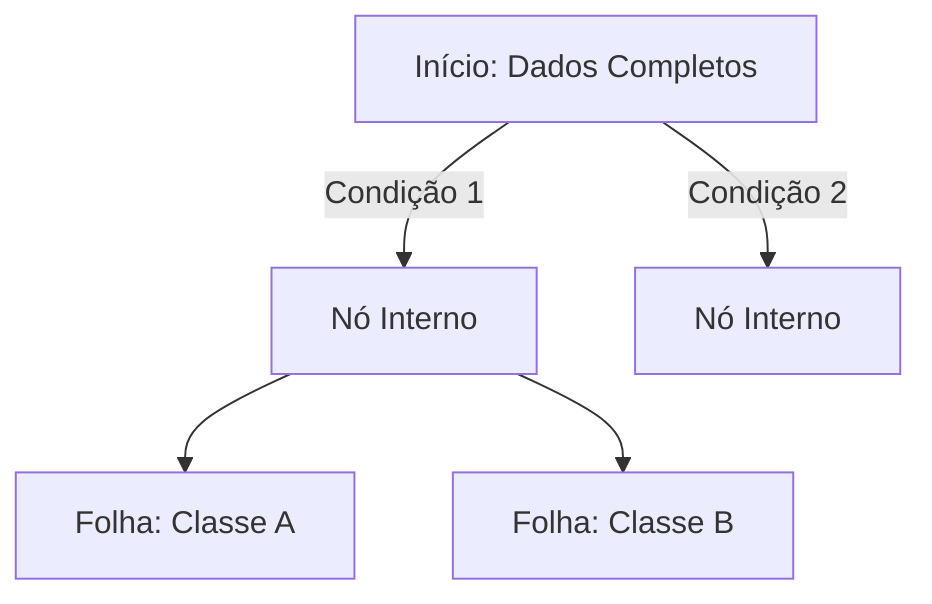

# Fundamentos de Inteligência Artificial

Este documento serve como um guia de referência técnica sobre os princípios fundamentais de IA, Machine Learning e Deep Learning.

---

## 1. Introdução e Taxonomia

Na ciência da computação, é crucial distinguir as camadas de abstração que compõem os sistemas inteligentes. Embora os termos sejam usados de forma intercambiável pelo público geral, tecnicamente eles possuem escopos distintos.

### Inteligência Artificial (IA)
Campo abrangente focado no desenvolvimento de sistemas capazes de realizar tarefas que requerem inteligência humana (raciocínio, percepção, tomada de decisão).
* **Objetivo:** Aumentar a capacidade humana, não necessariamente substituí-la.
* **Domínios:** NLP, Visão Computacional, Robótica, Sistemas Especialistas.

### Machine Learning (ML)
Subcampo da IA. Permite que sistemas aprendam e melhorem com dados sem programação explícita de regras para cada cenário.
* **Base:** Estatística e Probabilidade.
* **Tipos de Aprendizado:**
    1.  **Supervisionado:** Dados rotulados (Input + Output conhecido).
    2.  **Não Supervisionado:** Dados brutos (Apenas Input).
    3.  **Por Reforço (RL):** Aprendizado por tentativa e erro (Ambiente + Recompensa).

### Deep Learning (DL)
Subcampo do ML que utiliza Redes Neurais com múltiplas camadas ("profundas") para aprender representações hierárquicas de dados.
* **Diferencial:** Capacidade de extrair features automaticamente de dados não estruturados (imagens, áudio, texto).

---

## 2. Framework Matemático

Referência rápida das operações matemáticas essenciais para compreensão dos algoritmos.

### Notações e Álgebra
| Conceito | Notação | Descrição |
| :--- | :--- | :--- |
| **Somatório** | `Σ` | Soma de uma sequência de termos. |
| **Norma Euclidiana** | `||v||` | Magnitude (comprimento) de um vetor. |
| **Logaritmo** | `log(x)` | Fundamental para cálculo de entropia e funções de perda. |

### Matrizes e Vetores
Operações lineares são o motor das redes neurais.

```text
Transposta (Aᵀ)      :: Troca linhas por colunas.
Inversa (A⁻¹)        :: Matriz que reverte a transformação de A.
Determinante det(A)  :: Escalar que indica se a matriz é invertível.
Traço tr(A)          :: Soma da diagonal principal.
```

### Autovalores e Autovetores
Essenciais para redução de dimensionalidade (PCA).
> **Definição:** Um autovetor `v` é um vetor que não muda de direção quando uma transformação linear `A` é aplicada, apenas de escala. O fator de escala é o autovalor `λ`.

```text
Equação Característica:
A * v = λ * v
```

### Probabilidade
* **Esperança E[X]:** Média ponderada dos valores possíveis.
* **Variância Var(X):** Dispersão dos dados em relação à média.
* **Covariância Cov(X,Y):** Mede como duas variáveis variam em conjunto.

---

## 3. Algoritmos de Aprendizado Supervisionado

O objetivo é aprender uma função de mapeamento `f(x) = y`.

### Regressão Linear
Utilizada para prever valores **contínuos**.
* **Método:** OLS (Mínimos Quadrados Ordinários). Minimiza a soma dos erros quadráticos.

```text
Fórmula Simples: y = mx + c
Fórmula Múltipla: y = b₀ + b₁x₁ + ... + bₙxₙ
```

### Regressão Logística
Utilizada para **classificação binária**.
* **Ativação:** Usa a função Sigmoide para "espremer" a saída entre 0 e 1 (probabilidade).
* **Fronteira de Decisão:** Define o limiar (threshold) para classificar como 0 ou 1.

```text
Sigmoide: P(x) = 1 / (1 + e⁻ᶻ)
```

### Árvores de Decisão
Modelo não-linear que divide os dados baseando-se em regras de "se/então".
* **Métricas de Divisão:**
    * **Impureza de Gini:** Mede a probabilidade de classificação incorreta.
    * **Entropia:** Mede a desordem do sistema. O objetivo é maximizar o *Ganho de Informação*.



### Support Vector Machines (SVM)
Busca o hiperplano que maximiza a **margem** entre as classes.
* **Kernel Trick:** Projeta dados não linearmente separáveis em dimensões superiores para permitir a separação linear.

### Naive Bayes
Classificador probabilístico baseado no Teorema de Bayes.
> **Por que "Naive" (Ingênuo)?** Assume que todas as features são independentes entre si, o que raramente é verdade no mundo real, mas funciona surpreendentemente bem para textos e filtros de spam.

---

## 4. Algoritmos de Aprendizado Não Supervisionado

Focados na descoberta de padrões ocultos e estrutura dos dados.

### K-Means Clustering
Algoritmo iterativo para particionar dados em `K` grupos.
1.  Inicializa centroides.
2.  Atribui pontos ao centroide mais próximo.
3.  Recalcula centroides.
4.  Repete até a convergência.

### PCA (Principal Component Analysis)
Técnica de redução de dimensionalidade. Projeta os dados nos eixos de maior variância (Componentes Principais), descartando ruído e redundância.

### Detecção de Anomalias
Identificação de outliers (fraudes, falhas, intrusões).
* **Isolation Forest:** Isola anomalias cortando aleatoriamente o espaço de dados (anomalias são isoladas mais rápido que dados normais).
* **LOF (Local Outlier Factor):** Baseado na densidade local dos vizinhos.

---

## 5. Aprendizado por Reforço (Reinforcement Learning)

Um **Agente** aprende a tomar **Ações** em um **Ambiente** para maximizar uma **Recompensa** acumulada.

### Conceitos Chave
* **Exploração (Exploration):** Tentar ações novas para descobrir recompensas.
* **Explotação (Exploitation):** Usar o conhecimento atual para garantir recompensas.
* **Epsilon-Greedy:** Estratégia para balancear os dois conceitos acima.

### Q-Learning vs. SARSA
| Algoritmo | Tipo | Características |
| :--- | :--- | :--- |
| **Q-Learning** | Off-Policy | Ousado. Aprende o valor da *melhor* ação futura possível, ignorando erros exploratórios atuais. |
| **SARSA** | On-Policy | Conservador. Aprende o valor da ação que *realmente* será tomada, considerando a política atual (inclusive erros). |

```text
Equação de Bellman (Q-Learning):
Q(s,a) nova = Q(s,a) atual + taxa_aprendizado * [Recompensa + desconto * max(Q_futuro) - Q(s,a) atual]
```

---

## 6. Deep Learning & Redes Neurais

### O Perceptron
A unidade fundamental.
1.  **Inputs:** Entradas ponderadas por pesos (`w`).
2.  **Viés (Bias):** Deslocamento da função.
3.  **Ativação:** Introduz não-linearidade.

### Funções de Ativação
* **ReLU:** `max(0, x)`. Padrão da indústria. Resolve problemas de gradiente.
* **Sigmoide/Tanh:** Úteis para probabilidades, mas sofrem com gradientes que desaparecem (Vanishing Gradient).
* **Softmax:** Usada na última camada para classificação multiclasse.

### Arquiteturas Especializadas

#### CNNs (Convolucionais)
Especialistas em dados tipo "grade" (imagens).
* **Convolução:** Filtros que deslizam sobre a imagem extraindo bordas, texturas e formas.
* **Pooling:** Reduz a dimensão espacial, diminuindo o custo computacional.

#### RNNs, LSTMs e GRUs
Especialistas em sequências (Tempo/Texto).
* **Problema:** RNNs simples esquecem o início de sequências longas (Vanishing Gradient).
* **Solução (LSTM/GRU):** Mecanismos de "portões" (gates) que decidem matematicamente o que lembrar e o que esquecer a longo prazo.

---

## 7. IA Generativa (GenAI)

A fronteira atual da tecnologia. Foca na criação de novos dados.

### LLMs (Large Language Models)
Baseados na arquitetura **Transformer**.
* **Atenção (Self-Attention):** Permite que o modelo processe a relevância de cada palavra em relação a todas as outras da frase simultaneamente (paralelismo), superando a limitação sequencial das RNNs.
* **Embeddings:** Vetores densos que capturam o significado semântico das palavras.

### Diffusion Models
O estado da arte para geração de imagens.
1.  **Forward Process:** Destrói uma imagem adicionando ruído gaussiano até virar estática.
2.  **Reverse Process:** Uma rede neural aprende a inverter esse processo, "denificando" (denoising) o ruído aleatório para formar uma imagem nítida, condicionada por um prompt de texto.

teste