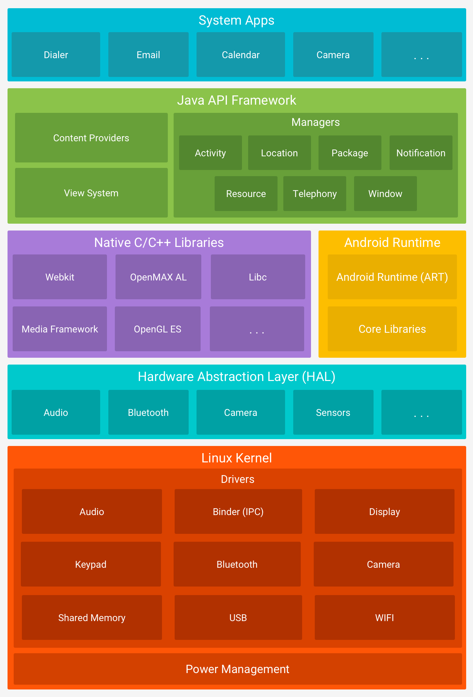

ã õ à À

Mobile hacking vem crescendo cada vez mais no que concerne estudos especializados, demanda e interesse por parte dos profissionais e entusiastas de cyber. Pela abordagem inicial ser diferente de um web ou infra, algumas pessoas constroem sob si mesmas barreiras que às impedem de se aprofundar nessa "nova tendência". Frases como "se é louco, mobile não é pra mim não..." são comunmente ditas por integrantes da comunidade. Dessa forma, esse artigo tem como objetivo desmistificar o mobile hacking.

# O Android.

Para atacar o Android, você precisa entender que ele é, na essência, um Linux paranoico... 

## Arquitetura e Segurança do Android
Antes de atacar um reino, precisamos saber como funcionam as coisas do lado de dentro das muralhas... O android possui possuem componentes que são divididos em seis camadas, como ilustrado abaixo.

