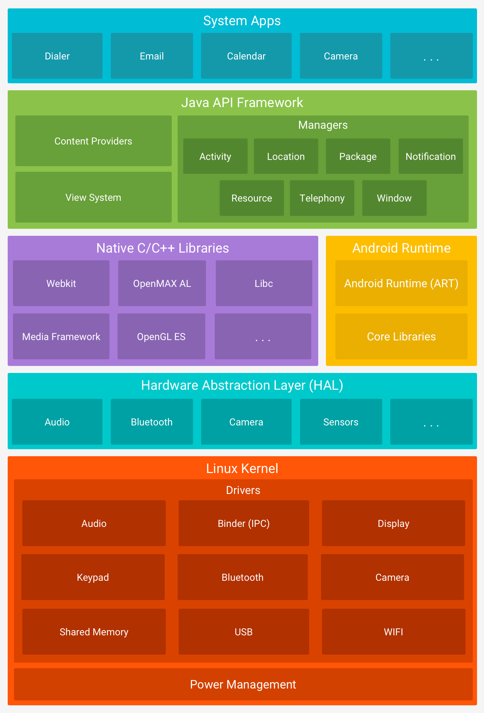

# Fundamentos do Android para Pentest

O Android é um Linux com isolamento rígido entre processos. Cada app roda com seu próprio User ID e é confinado em uma sandbox. Nossa missão é encontrar onde esse isolamento falha.

## Arquitetura e Superfície de Ataque

O Android é estruturado em camadas. Para um pentester, cada camada representa uma superfície de ataque diferente, com ferramentas e técnicas específicas.

## 1. System Apps

Apps do sistema habitam `/system/app` ou `/system/priv-app` e são somente leitura, exceto com root.

**Vetor: execução privilegiada.** Apps pré-instalados pelo fabricante frequentemente possuem permissões `signature` ou `system`. Uma vulnerabilidade neles pode resultar em execução de código com privilégios de sistema, próximo ao root, e em alguns casos com persistência que sobrevive ao factory reset.

## 2. Java API Framework

Camada que expõe o hardware para os apps. É onde ocorre a engenharia reversa dinâmica com ferramentas como o **Frida**.

**Vetores:** lógica de negócio mal implementada, Intents exportados sem proteção, Broadcasts sem validação de origem e vazamento de dados via logs.

## 3. Native C/C++ Libraries

Bibliotecas nativas usadas para tarefas de alta performance: renderização, áudio, SSL, processamento de imagem.

**Vetor: memory corruption.** Sem garbage collector, erros de gerenciamento manual de memória levam a Buffer Overflow, Use-After-Free e Integer Overflow. Exploits aqui contornam completamente a sandbox do Java.

## 4. Android Runtime (ART)

O ART substitui a Dalvik e opera com um ciclo de compilação híbrido:

1. **Instalação:** código parcialmente compilado para economizar espaço
2. **Execução inicial:** código interpretado
3. **JIT (Just-In-Time):** trechos frequentes são compilados em tempo real
4. **AOT (Ahead-Of-Time):** quando o dispositivo está ocioso, o daemon compila tudo para código nativo (`.oat` / `.elf`)

**Impacto no hooking:** o Frida precisa lidar com métodos em estados diferentes (interpretado vs. nativo). Hooks podem falhar quando o ART faz inlining de métodos. Entender o ciclo de vida do Zygote é necessário para criar hooks estáveis.

## 5. Hardware Abstraction Layer (HAL)

Camada onde o Android genérico encontra o hardware proprietário dos fabricantes (Samsung, Xiaomi, Motorola).

**Vetor: drivers proprietários.** O código do Google é auditado, mas drivers de câmera ou sensores biométricos desenvolvidos pelos fabricantes de chips frequentemente não são. Muitas falhas de escalação de privilégio local (LPE) têm origem aqui.

## 6. Linux Kernel

Base do sistema, com modificações específicas do Android: wakelocks, Binder IPC, ashmem.

**Binder:** mecanismo de IPC pelo qual quase toda comunicação entre processos passa. Explorar o driver do Binder permite interceptar mensagens globais do sistema.

**Rooting:** comprometer o kernel elimina as sandboxes, permite desativar o SELinux e concede controle total sobre o dispositivo.
